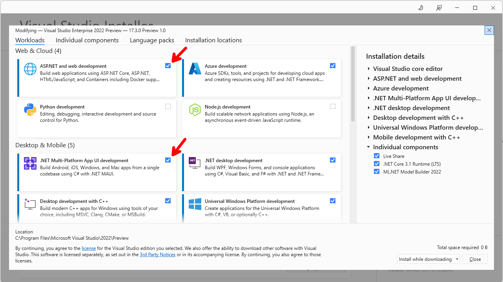

# Table of Contents

- [Table of Contents](#table-of-contents)
  - [Introduction](#introduction)
  - [Prerequisites](#prerequisites)
    - [.NET 6.0](#net-60)
    - [Visual Studio 2022](#visual-studio-2022)
    - [Required Workloads](#required-workloads)
  - [Demo](#demo)
    - [Clone the MsalAuthInMaui Repo](#clone-the-msalauthinmaui-repo)
    - [Add appsettings.json Support](#add-appsettingsjson-support)
      - [*NestedSettings.cs*](#nestedsettingscs)
      - [*Settings.cs*](#settingscs)
    - [Refactor the PCAWrapper Class](#refactor-the-pcawrapper-class)
    - [Add Twitter Authentication Support](#add-twitter-authentication-support)
      - [Create an Azure Active Directory B2C tenant](#create-an-azure-active-directory-b2c-tenant)
      - [Configure your Azure Active Directory B2C tenant](#configure-your-azure-active-directory-b2c-tenant)
      - [Setup Twitter Identity Provider](#setup-twitter-identity-provider)
      - [Create a User Flow](#create-a-user-flow)
      - [Test User Flow](#test-user-flow)
    - [Add Twitter Authentication Support in MAUI](#add-twitter-authentication-support-in-maui)
      - [*IPCAWrapper.cs*](#ipcawrappercs)
      - [*PCAWrapper.cs*](#pcawrappercs)
      - [*PCASocialWrapper.cs*](#pcasocialwrappercs)
      - [Sign in with Twitter](#sign-in-with-twitter)
      - [Create an Account with Email](#create-an-account-with-email)
    - [Verify Accounts](#verify-accounts)
  - [Summary](#summary)
  - [Complete Code](#complete-code)
  - [Resources](#resources)

## Introduction

In this episode, we are going to add social authorization support to the [MsalAuthInMaui](https://github.com/carlfranklin/MsalAuthInMaui) repo we built in the last episode.

> Note: Some of the images will not have correct resource names. The most important thing is that the configuration settings are correct.

We are going to start by enhancing the repo by writing some code to move out hard-coded settings, to an *appsettings.json* file. MAUI does not come with an *appsettings.json* file, but we are going to make that happen. We are going to follow James Montemagno's post [App Configuration Settings in .NET MAUI (appsettings.json)](https://montemagno.com/dotnet-maui-appsettings-json-configuration/) with some minor changes to meet our needs.

End results will look like this:.


Let's get to it.

## Prerequisites

The following prerequisites are needed for this demo.

### .NET 6.0

Download the latest version of the .NET 6.0 SDK [here](https://dotnet.microsoft.com/en-us/download).

### Visual Studio 2022

For this demo, we are going to use the latest version of [Visual Studio 2022](https://visualstudio.microsoft.com/vs/community/).

### Required Workloads

In order to build ASP.NET Core Web API applications, the `ASP.NET and web development` workload needs to be installed. In order to build `.NET MAUI` applications, you also need the `.NET Multi-platform App UI development` workload, so if you do not have them installed let's do that now.

  

## Demo

In the following demo let's start by cloning the `MsalAuthInMaui` repo, and then move out the hard-coded settings to an *appsettings.json* file.

### Clone the MsalAuthInMaui Repo

Clone the [MsalAuthInMaui](https://github.com/carlfranklikn/MsalAuthInMaui) repo and rename the folder MsalSocialAuthInMaui

```powershell
git clone https://github.com/carlfranklin/MsalAuthInMaui
```

### Add appsettings.json Support

Open the *MsalAuthInMaui.sln* solution, and add the following NuGet packages to the *MsalAuthInMaui.csproj* project, by following the following commands in the `Package Manager Console`.

  

```powershell
install-package Microsoft.Extensions.Configuration.Binder
install-package Microsoft.Extensions.Configuration.Json
install-package Newtonsoft.Json
```

>:blue_book: Make sure you select the MsalAuthInMaui project.


Add a new *appsettings.json* file to the *MsalAuthInMaui.csproj* project.

  

  

Change the Build Action to Embedded resource.

  

Add the following code to the *appsettings.json* file:

```json
{
  "Settings": {
    "ClientId": "REPLACE-WITH-YOUR-CLIENT-ID",
    "TenantId": "REPLACE-WITH-YOUR-TENANT-ID",
    "Authority": "https://login.microsoftonline.com/REPLACE-WITH-YOUR-TENANT-ID",
    "Scopes": [
        { "Value": "api://REPLACE-WITH-YOUR-CLIENT-ID/access_as_user" }
      ]
    }
}
```

>:point_up: Replace your ClientId, and TenantId with your own values from Azure B2C settings. See episode 24 for details.

Add two new classes *NestedSettings.cs*, and *Settings.cs*, and add the following code:

#### *NestedSettings.cs*

```csharp
namespace MsalAuthInMaui
{
    public class NestedSettings
    {
        public string Value { get; set; } = null;
    }
}
```

#### *Settings.cs*

```csharp
namespace MsalAuthInMaui
{
    public class Settings
    {
        public string ClientId { get; set; } = null;
        public string TenantId { get; set; } = null;
        public string Authority { get; set; } = null;
        public NestedSettings[] Scopes { get; set; } = null;
    }
}
```

At this point, we have everything ready to get the values from *appsettings.json*, and assign them to the Settings class. Let's open the *MauiProgram.cs* file, and add the following two using statements:

```csharp
global using Microsoft.Extensions.Configuration;
global using System.Reflection;
```

Now, we are going to use Reflection to get the values from the *appsettings.json* file, and a `ConfigurationBuilder` to the builder process. We are also going to add our `MainPage` as a transient service, and make a small change to it.

Add the following code below `ConfigureFonts` in the *MauiProgram.cs* file:

```csharp
var executingAssembly = Assembly.GetExecutingAssembly();

using var stream = executingAssembly.GetManifestResourceStream("MsalAuthInMaui.appsettings.json");

var configuration = new ConfigurationBuilder()
            .AddJsonStream(stream)
            .Build();

builder.Services.AddTransient<MainPage>();

builder.Configuration
    .AddConfiguration(configuration);
```

The complete code should look like this:

```csharp
using Microsoft.Extensions.Configuration;
using System.Reflection;

namespace MsalAuthInMaui
{
    public static class MauiProgram
    {
        public static MauiApp CreateMauiApp()
        {
            var builder = MauiApp.CreateBuilder();
            builder
                .UseMauiApp<App>()
                .ConfigureFonts(fonts =>
                {
                    fonts.AddFont("OpenSans-Regular.ttf", "OpenSansRegular");
                    fonts.AddFont("OpenSans-Semibold.ttf", "OpenSansSemibold");
                });

            var executingAssembly = Assembly.GetExecutingAssembly();

            using var stream = executingAssembly.GetManifestResourceStream("MsalAuthInMaui.appsettings.json");

            var configuration = new ConfigurationBuilder()
                        .AddJsonStream(stream)
                        .Build();

            builder.Services.AddTransient<MainPage>();

            builder.Configuration
                .AddConfiguration(configuration);

            return builder.Build();
        }
    }
}
```

Then change the *App.xaml.cs* file to accept the `MainPage` we just defined as a transient service in the *MauiProgram.cs* file:

```csharp
namespace MsalAuthInMaui
{
    public partial class App : Application
    {
        public App(MainPage page)
        {
            InitializeComponent();

            MainPage = page;
        }
    }
}
```

Now we are all setup to read *appsettings.json* settings, and have them easily accesible in our `Settings` class.

#### Add an Extension Method

Add a new *Extensions.cs* class with the following code:

```csharp
using Newtonsoft.Json;
using System.Text;

namespace MsalAuthInMaui
{
    public static class Extensions
    {
        public static StringContent ToJsonStringContent(this object o) => new(JsonConvert.SerializeObject(o), Encoding.UTF8, "application/json");

        public static string[] ToStringArray(this NestedSettings[] nestedSettings)
        {
            string[] result = new string[nestedSettings.Length];

            for (int i = 0; i < nestedSettings.Length; i++)
            {
                result[i] = nestedSettings[i].Value;
            }

            return result;
        }
    }
}
```

### Refactor the PCAWrapper Class

We are going to refactor the PCAWrapper class provided by Microsoft in [Microsoft identity platform code samples](https://docs.microsoft.com/en-us/azure/active-directory/develop/sample-v2-code), to accept an `IConfiguration` object, and set our new `Settings` property, to remove all hard-coded values.

Open the *PCAWrapper.cs* file, and replace the code with this:

```csharp
// Copyright (c) Microsoft Corporation. All rights reserved.
// Licensed under the MIT License.

using Microsoft.Extensions.Configuration;
using Microsoft.Identity.Client;
using static System.Formats.Asn1.AsnWriter;

namespace MsalAuthInMaui
{
    /// <summary>
    /// This is a wrapper for PCA. It is singleton and can be utilized by both application and the MAM callback
    /// </summary>
    public class PCAWrapper
    {
        private IConfiguration _configuration;
        private static Settings _settings { get; set; }

        internal IPublicClientApplication PCA { get; }

        internal bool UseEmbedded { get; set; } = false;
        public string[] Scopes { get; set; }

        // public constructor
        public PCAWrapper(IConfiguration configuration)
        {
            _configuration = configuration;
            _settings = _configuration.GetRequiredSection("Settings").Get<Settings>();
            Scopes = _settings.Scopes.ToStringArray();

            // Create PCA once. Make sure that all the config parameters below are passed
            PCA = PublicClientApplicationBuilder
                                        .Create(_settings.ClientId)
                                        .WithRedirectUri(PlatformConfig.Instance.RedirectUri)
                                        .WithIosKeychainSecurityGroup("com.microsoft.adalcache")
                                        .Build();
        }

        /// <summary>
        /// Acquire the token silently
        /// </summary>
        /// <param name="scopes">desired scopes</param>
        /// <returns>Authentication result</returns>
        public async Task<AuthenticationResult> AcquireTokenSilentAsync(string[] scopes)
        {
            var accts = await PCA.GetAccountsAsync().ConfigureAwait(false);
            var acct = accts.FirstOrDefault();

            var authResult = await PCA.AcquireTokenSilent(scopes, acct)
                                        .ExecuteAsync().ConfigureAwait(false);
            return authResult;

        }

        /// <summary>
        /// Perform the interactive acquisition of the token for the given scope
        /// </summary>
        /// <param name="scopes">desired scopes</param>
        /// <returns></returns>
        public async Task<AuthenticationResult> AcquireTokenInteractiveAsync(string[] scopes)
        {
            var systemWebViewOptions = new SystemWebViewOptions();
#if IOS
            // embedded view is not supported on Android
            if (UseEmbedded)
            {

                return await PCA.AcquireTokenInteractive(scopes)
                                        .WithUseEmbeddedWebView(true)
                                        .WithParentActivityOrWindow(PlatformConfig.Instance.ParentWindow)
                                        .ExecuteAsync()
                                        .ConfigureAwait(false);
            }

            // Hide the privacy prompt in iOS
            systemWebViewOptions.iOSHidePrivacyPrompt = true;
#endif

            return await PCA.AcquireTokenInteractive(scopes)
                                    .WithAuthority(_settings.Authority)
                                    .WithTenantId(_settings.TenantId)
                                    .WithParentActivityOrWindow(PlatformConfig.Instance.ParentWindow)
                                    .WithUseEmbeddedWebView(true)
                                    .ExecuteAsync()
                                    .ConfigureAwait(false);
        }

        /// <summary>
        /// Signout may not perform the complete signout as company portal may hold
        /// the token.
        /// </summary>
        /// <returns></returns>
        public async Task SignOutAsync()
        {
            var accounts = await PCA.GetAccountsAsync().ConfigureAwait(false);
            foreach (var acct in accounts)
            {
                await PCA.RemoveAsync(acct).ConfigureAwait(false);
            }
        }
    }
}
```

Finally, open up the *MainPage.xaml.cs* file, and replace the code with the following:

```csharp
using Microsoft.Extensions.Configuration;
using Microsoft.Identity.Client;

namespace MsalAuthInMaui
{
    public partial class MainPage : ContentPage
    {
        private string _accessToken = string.Empty;
        private PCAWrapper _pcaWrapper;
        private IConfiguration _configuration;

        bool _isLoggedIn = false;
        public bool IsLoggedIn
        {
            get => _isLoggedIn;
            set
            {
                if (value == _isLoggedIn) return;
                _isLoggedIn = value;
                OnPropertyChanged(nameof(IsLoggedIn));
            }
        }

        public MainPage(IConfiguration configuration)
        {
            _configuration = configuration;
            _pcaWrapper = new PCAWrapper(_configuration);
            BindingContext = this;
            InitializeComponent();
            _ = Login();
        }

        async private void OnLoginButtonClicked(object sender, EventArgs e)
        {
            await Login().ConfigureAwait(false);
        }

        private async Task Login()
        {
            try
            {
                // Attempt silent login, and obtain access token.
                var result = await _pcaWrapper.AcquireTokenSilentAsync(_pcaWrapper.Scopes).ConfigureAwait(false);
                IsLoggedIn = true;

                // Set access token.
                _accessToken = result.AccessToken;

                // Display Access Token from AcquireTokenSilentAsync call.
                await ShowOkMessage("Access Token from AcquireTokenSilentAsync call", _accessToken).ConfigureAwait(false);
            }
            // A MsalUiRequiredException will be thrown, if this is the first attempt to login, or after logging out.
            catch (MsalUiRequiredException)
            {
                // Perform interactive login, and obtain access token.
                var result = await _pcaWrapper.AcquireTokenInteractiveAsync(_pcaWrapper.Scopes).ConfigureAwait(false);
                IsLoggedIn = true;

                // Set access token.
                _accessToken = result.AccessToken;

                // Display Access Token from AcquireTokenInteractiveAsync call.
                await ShowOkMessage("Access Token from AcquireTokenInteractiveAsync call", _accessToken).ConfigureAwait(false);
            }
            catch (Exception ex)
            {
                IsLoggedIn = false;
                await ShowOkMessage("Exception in AcquireTokenSilentAsync", ex.Message).ConfigureAwait(false);
            }
        }

        async private void OnLogoutButtonClicked(object sender, EventArgs e)
        {
            // Log out.
            _ = await _pcaWrapper.SignOutAsync().ContinueWith(async (t) =>
            {
                await ShowOkMessage("Signed Out", "Sign out complete.").ConfigureAwait(false);
                IsLoggedIn = false;
                _accessToken = string.Empty;
            }).ConfigureAwait(false);
        }

        async private void OnGetWeatherForecastButtonClicked(object sender, EventArgs e)
        {
            // Call the Secure Web API to get the weatherforecast data.
            var weatherForecastData = await CallSecureWebApi(_accessToken).ConfigureAwait(false);

            // Show the data.
            if (weatherForecastData != string.Empty)
                await ShowOkMessage("WeatherForecast data", weatherForecastData).ConfigureAwait(false);
        }

        // Call the Secure Web API.
        private static async Task<string> CallSecureWebApi(string accessToken)
        {
            if (accessToken == string.Empty)
                return string.Empty;

            try
            {
                // Get the weather forecast data from the Secure Web API.
                var client = new HttpClient();

                // Create the request.
                var message = new HttpRequestMessage(HttpMethod.Get, "{REPLACE-WITH-YOUR-SECURE-WEB-API-URL}/weatherforecast");

                // Add the Authorization Bearer header.
                message.Headers.Add("Authorization", $"Bearer {accessToken}");

                // Send the request.
                var response = await client.SendAsync(message).ConfigureAwait(false);

                // Get the response.
                var responseString = await response.Content.ReadAsStringAsync().ConfigureAwait(false);

                response.EnsureSuccessStatusCode();

                // Return the response.
                return responseString;
            }
            catch (Exception ex)
            {
                return ex.ToString();
            }
        }

        private Task ShowOkMessage(string title, string message)
        {
            _ = Dispatcher.Dispatch(async () =>
            {
                await DisplayAlert(title, message, "OK").ConfigureAwait(false);
            });
            return Task.CompletedTask;
        }
    }
}
```

You must also replace `{REPLACE-WITH-YOUR-SECURE-WEB-API-URL}` with your secure web api url.

Now, you should be able to run the app, and everything should work as it did before.

### Add Twitter Authentication Support

We are going to add the ability to authenticate to our application with Twitter, and still be able to call our secure Web API.

Let's start by going to the Twitter's `Developer Platform` portal at (https://developer.twitter.com/). If you do not have an account, create an account at this time.

Click on `Developer Portal`:

  

Go to `Overview`.

  

Towards the bottom, click on `+ Create App`.

  

Give it a name, and click Next. I would encourage you to use `MsalAuthInMaui` with a unique suffix that identifies you, such your company or your name. In my case, my suffix is TDNS (The Dot Net Show), so I'm naming my app `MsalAuthInMauiTDNS`


Copy your `API Key`, and `API Key Secret` in a safe place, as we are going to need them to set up our Twitter Identity Provider in Azure AD B2C, and we will not be able to retrieve those later. Then click on `App Settings`.

  

In order to provide authentication support using Twitter, we need to setup `OAuth 2.0a Authentication`. Click on `Set up`.


Keep the defaults, and check `Native App`.

  

Enter the url to your up and coming b2c app registration which will be `https://msalauthinmaui{YOUR-SUFFIX-HERE}.b2clogin.com/msalauthinmaui{YOUR-SUFFIX-HERE}.onmicrosoft.com/b2c_1_twitter_susi/oauth1/authresp` for the `Callback URI / Redirect URL`, and give it a `Website URL`, and click `Save`. Make sure to replace {YOUR-SUFFIX-HERE} with your unique suffix.


You will be presented with your `OAuth 2.0 Client ID and Client Secret` screen. Store those values in a safe place. Click `Done`, and then `Yes, I saved it`.

  

#### Create an Azure Active Directory B2C tenant

In the last episode, we went straight to `Azure B2C`, and created a new `App registration`. For social authentication, we will need to create a new tenant, so we can take advantage of the Azure's `Identity Providers` to allow social network authentication support, including Twitter, Google, Facebook, Apple, and others.

Go to [Azure](https://portal.azure.com/), and select your subscription.

Type `azure b2c` in the search box, and click on `Azure AD B2C`.

  

  

>:point_up: In the last demo, we went to `Azure AD B2C`, and then straight to `App registrations` to setup our app. Notice that the left menu is missing things like `Identity Providers`, `API connectors`, `User Flows`, etc.

Click on `Get started`, under `Create an Azure AD B2C tenant`, to get the instructions on how to create a new Azure AD B2C tenant, which will include those missing items.

That should take you to [Tutorial: Create an Azure Active Directory B2C tenant](https://docs.microsoft.com/en-us/azure/active-directory-b2c/tutorial-create-tenant?WT.mc_id=Portal-Microsoft_AAD_B2CAdmin) with instructions on to create an Azure AD B2C tenant. Follow the instructions, and make sure you set the `Initial domain name` to `MsalAuthInMaui{YOUR_SUFFIX}`. 

  

#### Configure your Azure Active Directory B2C tenant

Once you create your new `MsalAuthInMaui` Azure B2C tenant, and switch to it, you should be able to see the following:

 

>:point_up: Notice that the left menu now has `Identity Providers`, `API connectors`, `User Flows`, etc.

As we did before, go to `App registrations`, add `New registration`, enter the following values, and click on `Register`.

  

| Setting                 | Value                                                        |
| ----------------------- | ------------------------------------------------------------ |
| Name                    | MsalAuthInMaui{YOUR-SUFFIX-HERE}                             |
| Supported account types | Accounts in any identity provider or organizational directory (for authenticating users with user flows) |
| Redirect URI            | Select Public client/native (mobile & desktop), and enter your redirect url from MainActivity.cs. Ex: msauth://com.companyname.msalauthinmaui/snaHlgr4autPsfVDSBVaLpQXnqU= |
| Permissions             | Check the Grant admin consent to openid and offline_access permissions box |

  

Notice a new `Application (client) ID`, and `Directory (tenant) ID`, will be generated.

  

Go ahead, and copy those new values, and replace the ones in the *appsettings.json* file of our `SecureWebApi` project.

Go to the new `App registration`.

  

Go to `Authentication`, click on `+ Add a platform`, then on Web.

  

Enter your secure webapi url + "/signin-oidc". Ex: `https://as-securewebapi.azurewebsites.net/signin-oidc` as the Redirect URI, and check `Access tokens (used for implicit flows)`, and `ID tokens (used for implicit and hybrid flows`)

  

#### 

  

#### Add Twitter Callback URL

For the Web platform, click `Add URI` and copy the callback URL you set up in the Twitter account. This should be `https://msalauthinmaui{YOUR-SUFFIX}.b2clogin.com/msalauthinmaui{YOUR-SUFFIX}.onmicrosoft.com/b2c_1_twitter_susi/oauth1/authresp` with your suffix substituted


Make the following selections, and click on Save.

  

Go to `Certificates & secrets` to add a new client secret, copy the value, and replace the `ClientSecret` setting in our `SecureWebApi`'s *appsettings.json* file.

  

Go to `Expose an API`, click on `+ Add a scope`, and enter `access_as_user` for the `Scope name`, `Call the SecureWebAPI endpoints.` for the `Admin consent display name`, and `Allows the app to call the SecureWebAPI endpoints.` for the `Admin consent description`. Then keep `Enabled` checked, and click on `Add scope`.

  

Go to `API permissions`, click on `+ Add a permission`, then on `My APIs`, and select `MsalAuthInMaui`.

  

Then click on `Delegated permissions`, check `access_as_user`, and click `Add permissions`.

  

Finally, go to `Branding & properties`, and get the `Publisher domain`, in our case `msalauthinmaui.onmicrosoft.com`, and update the `Domain` setting in the *appsettings.json* file of the `SecureWebApi` project.

Then for the `Instance` setting, also in *appsettings.json*, replace the `https://login.microsoftonline.com/` value we had in our previous demo, with `https://msalauthinmaui.b2clogin.com/`.

The complete file should look like below, but with your own IDs:

```json
{
  "AzureAd": {
    "Instance": "https://msalauthinmaui{YOUR-SUFFIX-HERE}.b2clogin.com/",
    "Domain": "msalauthinmaui.onmicrosoft.com",
    "TenantId": "REPLACE-WITH-YOUR-TENANT_ID",
    "ClientId": "REPLACE-WITH-YOUR-CLIENT_ID",
    "CallbackPath": "/signin-oidc",
    "Scopes": "access_as_user",
    "ClientSecret": "REPLACE-WITH-YOUR-CLIENT-SECRET",
    "ClientCertificates": [],
  },
  "MicrosoftGraph": {
    "BaseUrl": "https://graph.microsoft.com/v1.0",
    "Scopes": "user.read"
  },
  "DownstreamApi": {
    "BaseUrl": "REPLACE-WITH-YOUR-SECURE-API-URL",
    "Scopes": "user.read"
  },
  "Logging": {
    "LogLevel": {
      "Default": "Information",
      "Microsoft.AspNetCore": "Warning"
    }
  },
  "AllowedHosts": "*"
}
```

#### Grant admin consent

Note that in the lower-left, you have not granted admin consent (also note that this graphic shows a different resource than yours)


Select `Grant admin consent for {YOUR-RESOURCE}` and then click `Yes` to confirm

#### Setup Twitter Identity Provider

Go back to the MsalAuthInMaui Azure B2C tenant, click on `Identity providers`, then on `Twitter`, and enter `Twitter` for the name, and paste the Client ID and Client Secret, which are the `API Key` and `API Key Secret` that we saved when we set up our app in the Twitter's `Developer Platform` portal.

  

>:point_up: The Client ID and Client Secret needed are not the OAuth 2.0 values we stored also, but the Twitter API Key and API Key Secret under the Consumer Keys section in the Twitter Developer Portal, Keys and Tokens section.

#### Create a User Flow

Now we need to create a `Sign up and sign in` user flow. Go to `User flows`, and click on `+ New user flow`.

  

Here we can create a few different user flows, depending on the things we want to allow in our application. For now, we are only interested in the `Sign up and sign in` user flow, so click that, then keep the recommended version, and click on `Create`.

  

Give it a name of `twitter_susi` to distinguish from other identity provider flows, for instance if we add support for `Google`, `Facebook`, etc. Enable `Email signup`, this will allow the users to create accounts with their own email, and password. Check the Twitter box under `Social identity providers`, and keep the Email, MFA enforcement defaults.

  

>:point_up: Notice that the full name will be `B2C_1_twitter_susi`, and `B2C_1_` is pre-appended. This is important, as we are going to need the name of the flow in our MAUI application.

Check the attributes you want to collect when the users create an account with email and password, and any attributes you want to return in the access token. For our purposes, we are only going to select the `Display Name`, and keep the rest of the default values, (this selections can be changed later at any time.) Click on `Show more...`, in order to select `Display Name`, then click on `Ok`, and finally on `Create`.

  

  


### Re-Publish the SecureWeb API project

Because we've made changes to the configuration, this is a good time to re-publish the API project.

#### Test User Flow

You can test the user flow, by clicking on it, and then clicking on `Run user flow`.

  

If everything is successfully configured, you should see a new tab, with the UI that eventually is going to show up in our MAUI app.

 

Press the `Twitter` button and you should see something like this.

  

You can now choose `Authorize app` or leave that step until later. The important thing is that you got this far.

Go back to the *appsettings.json* file in our SecureWebApi application, and add `"SignUpSignInPolicyId": "b2c_1_twitter_susi"` below `"ClientCertificates": [],`:

```json
  "AzureAd": {
    "Instance": "****************************,
    "Domain": "****************************",
    "TenantId": "****************************",
    "ClientId": "****************************",
    "CallbackPath": "/signin-oidc",
    "Scopes": "access_as_user",
    "ClientSecret": "****************************",
    "ClientCertificates": [],
    "SignUpSignInPolicyId": "b2c_1_twitter_susi"
  },
```

Right-click the SecureWebApi project, and publish the application.

  

  

### Add Twitter Authentication Support in MAUI

Now, it is time to take everything we put together, and finally add Twitter Authentication support in our MAUI application.

Since our `PCAWrapper` is going to change in the way we call `Azure AD B2C`, and to keep things separate, let's create an interface, and then create a new `PCASocialWrapper`

Duplicate the *PCAWrapper.cs* file, and name it *PCASocialWrapper.cs*, then rename the class, and constructor accordingly.

Then we are going to change our *PCASocialWrapper.cs* file to add support for social authentication flows.

Update the *IPCAWrapper.cs*, *PCAWrapper.cs*, and *PCASocialWrapper.cs* files to look like this:

#### *IPCAWrapper.cs*

```csharp
using Microsoft.Identity.Client;

namespace MsalAuthInMaui
{
    public interface IPCAWrapper
    {
        string[] Scopes { get; set; }
        Task<AuthenticationResult> AcquireTokenInteractiveAsync(string[] scopes);
        Task<AuthenticationResult> AcquireTokenSilentAsync(string[] scopes);
        Task SignOutAsync();
    }
}
```

#### *PCAWrapper.cs*

```csharp
// Copyright (c) Microsoft Corporation. All rights reserved.
// Licensed under the MIT License.

using Microsoft.Extensions.Configuration;
using Microsoft.Identity.Client;
using static System.Formats.Asn1.AsnWriter;

namespace MsalAuthInMaui
{
    /// <summary>
    /// This is a wrapper for PCA. It is singleton and can be utilized by both application and the MAM callback
    /// </summary>
    public class PCAWrapper : IPCAWrapper
    {
        private IConfiguration _configuration;
        private static Settings _settings { get; set; }

        internal IPublicClientApplication PCA { get; }

        internal bool UseEmbedded { get; set; } = false;
        public string[] Scopes { get; set; }

        // public constructor
        public PCAWrapper(IConfiguration configuration)
        {
            _configuration = configuration;
            _settings = _configuration.GetRequiredSection("Settings").Get<Settings>();
            Scopes = _settings.Scopes.ToStringArray();

            // Create PCA once. Make sure that all the config parameters below are passed
            PCA = PublicClientApplicationBuilder
                                        .Create(_settings.ClientId)
                                        .WithRedirectUri(PlatformConfig.Instance.RedirectUri)
                                        .WithIosKeychainSecurityGroup("com.microsoft.adalcache")
                                        .Build();
        }

        /// <summary>
        /// Acquire the token silently
        /// </summary>
        /// <param name="scopes">desired scopes</param>
        /// <returns>Authentication result</returns>
        public async Task<AuthenticationResult> AcquireTokenSilentAsync(string[] scopes)
        {
            var accts = await PCA.GetAccountsAsync().ConfigureAwait(false);
            var acct = accts.FirstOrDefault();

            var authResult = await PCA.AcquireTokenSilent(scopes, acct)
                                        .ExecuteAsync().ConfigureAwait(false);
            return authResult;

        }

        /// <summary>
        /// Perform the interactive acquisition of the token for the given scope
        /// </summary>
        /// <param name="scopes">desired scopes</param>
        /// <returns></returns>
        public async Task<AuthenticationResult> AcquireTokenInteractiveAsync(string[] scopes)
        {
            var systemWebViewOptions = new SystemWebViewOptions();
#if IOS
            // embedded view is not supported on Android
            if (UseEmbedded)
            {

                return await PCA.AcquireTokenInteractive(scopes)
                                        .WithUseEmbeddedWebView(true)
                                        .WithParentActivityOrWindow(PlatformConfig.Instance.ParentWindow)
                                        .ExecuteAsync()
                                        .ConfigureAwait(false);
            }

            // Hide the privacy prompt in iOS
            systemWebViewOptions.iOSHidePrivacyPrompt = true;
#endif

            return await PCA.AcquireTokenInteractive(scopes)
                                    .WithAuthority(_settings.Authority)
                                    .WithTenantId(_settings.TenantId)
                                    .WithParentActivityOrWindow(PlatformConfig.Instance.ParentWindow)
                                    .WithUseEmbeddedWebView(true)
                                    .ExecuteAsync()
                                    .ConfigureAwait(false);
        }

        /// <summary>
        /// Signout may not perform the complete signout as company portal may hold
        /// the token.
        /// </summary>
        /// <returns></returns>
        public async Task SignOutAsync()
        {
            var accounts = await PCA.GetAccountsAsync().ConfigureAwait(false);
            foreach (var acct in accounts)
            {
                await PCA.RemoveAsync(acct).ConfigureAwait(false);
            }
        }
    }
}
```

#### *PCASocialWrapper.cs*

Ignore compiler errors for now.

```csharp
// Copyright (c) Microsoft Corporation. All rights reserved.
// Licensed under the MIT License.

using Microsoft.Extensions.Configuration;
using Microsoft.Identity.Client;
using static System.Formats.Asn1.AsnWriter;

namespace MsalAuthInMaui
{
    /// <summary>
    /// This is a wrapper for PCA. It is singleton and can be utilized by both application and the MAM callback
    /// </summary>
    public class PCASocialWrapper : IPCAWrapper
    {
        private IConfiguration _configuration;
        private static Settings _settings { get; set; }

        internal IPublicClientApplication PCA { get; }

        internal bool UseEmbedded { get; set; } = false;
        public string[] Scopes { get; set; }

        // public constructor
        public PCASocialWrapper(IConfiguration configuration)
        {
            _configuration = configuration;
            _settings = _configuration.GetRequiredSection("Settings").Get<Settings>();
            Scopes = _settings.ScopesForTwitter.ToStringArray();

            // Create PCA once. Make sure that all the config parameters below are passed
            PCA = PublicClientApplicationBuilder
                                        .Create(_settings.ClientIdForTwitter)
                                        .WithB2CAuthority(_settings.AuthorityForTwitter)
                                        .WithRedirectUri(PlatformConfig.Instance.RedirectUri)
                                        .WithIosKeychainSecurityGroup("com.microsoft.adalcache")
                                        .Build();
        }

        /// <summary>
        /// Acquire the token silently
        /// </summary>
        /// <param name="scopes">desired scopes</param>
        /// <returns>Authentication result</returns>
        public async Task<AuthenticationResult> AcquireTokenSilentAsync(string[] scopes)
        {
            var accts = await PCA.GetAccountsAsync(_settings.PolicySignUpSignInForTwitter).ConfigureAwait(false);
            var acct = accts.FirstOrDefault();

            var authResult = await PCA.AcquireTokenSilent(scopes, acct)
                                        .ExecuteAsync().ConfigureAwait(false);
            return authResult;

        }

        /// <summary>
        /// Perform the interactive acquisition of the token for the given scope
        /// </summary>
        /// <param name="scopes">desired scopes</param>
        /// <returns></returns>
        public async Task<AuthenticationResult> AcquireTokenInteractiveAsync(string[] scopes)
        {
            var systemWebViewOptions = new SystemWebViewOptions();
#if IOS
            // embedded view is not supported on Android
            if (UseEmbedded)
            {

                return await PCA.AcquireTokenInteractive(scopes)
                                        .WithUseEmbeddedWebView(true)
                                        .WithParentActivityOrWindow(PlatformConfig.Instance.ParentWindow)
                                        .ExecuteAsync()
                                        .ConfigureAwait(false);
            }

            // Hide the privacy prompt in iOS
            systemWebViewOptions.iOSHidePrivacyPrompt = true;
#endif

            var accounts = await PCA.GetAccountsAsync(_settings.PolicySignUpSignInForTwitter).ConfigureAwait(false); ;
            var acct = accounts.FirstOrDefault();

            return await PCA.AcquireTokenInteractive(scopes)
                                    .WithB2CAuthority(_settings.AuthorityForTwitter)
                                    .WithAccount(accounts.FirstOrDefault())
                                    .WithParentActivityOrWindow(PlatformConfig.Instance.ParentWindow)
                                    .WithUseEmbeddedWebView(true)
                                    .ExecuteAsync()
                                    .ConfigureAwait(false);
        }

        /// <summary>
        /// Signout may not perform the complete signout as company portal may hold
        /// the token.
        /// </summary>
        /// <returns></returns>
        public async Task SignOutAsync()
        {
            var accounts = await PCA.GetAccountsAsync().ConfigureAwait(false);
            foreach (var acct in accounts)
            {
                await PCA.RemoveAsync(acct).ConfigureAwait(false);
            }
        }
    }
}
```

Open the *MainPage.xaml* file, and add a Login With Twitter button.

```xaml
<?xml version="1.0" encoding="utf-8" ?>
<ContentPage xmlns="http://schemas.microsoft.com/dotnet/2021/maui"
			 xmlns:x="http://schemas.microsoft.com/winfx/2009/xaml"
			 x:Class="MsalAuthInMaui.MainPage">

    <ScrollView>
        <VerticalStackLayout Spacing="25"
							 Padding="30,0"
							 VerticalOptions="Center">

            <Image Source="dotnet_bot.png"
				   SemanticProperties.Description="Cute dot net bot waving hi to you!"
				   HeightRequest="200"
				   HorizontalOptions="Center" />

            <Label Text="Hello, World!"
				   SemanticProperties.HeadingLevel="Level1"
				   FontSize="32"
				   HorizontalOptions="Center" />

            <Label Text="Welcome to .NET Multi-platform App UI"
				   SemanticProperties.HeadingLevel="Level2"
				   SemanticProperties.Description="Welcome to dot net Multi platform App U I"
				   FontSize="18"
				   HorizontalOptions="Center" />

            <HorizontalStackLayout 
				HorizontalOptions="Center">
                <Button x:Name="LoginButton"
						Text="Log in (MS)"
						SemanticProperties.Hint="Log in"
						Clicked="OnLoginButtonClicked"
						HorizontalOptions="Center"
						Margin="8,0,8,0" />

                <Button x:Name="LogoutButton"
						Text="Log out"
						SemanticProperties.Hint="Log out"
						Clicked="OnLogoutButtonClicked"
						HorizontalOptions="Center"
						Margin="8,0,8,0" />
            </HorizontalStackLayout>


            <Label Text="Login with your social account"
				   SemanticProperties.HeadingLevel="Level1"
				   FontSize="18"
				   HorizontalOptions="Center" />

            <HorizontalStackLayout HorizontalOptions="Center">
                <Button x:Name="LoginWithTwitterButton"
						Text="Login (Social)"
						SemanticProperties.Hint="Log in with Twitter"
						Clicked="OnLoginWithTwitterButtonClicked"
						HorizontalOptions="Center"
						Margin="8,0,8,0" />
            </HorizontalStackLayout>

            <Button x:Name="GetWeatherForecastButton"
					Text="Get Weather Forecast"
					SemanticProperties.Hint="Get weather forecast data"
					Clicked="OnGetWeatherForecastButtonClicked"
					HorizontalOptions="Center"
					IsEnabled="{Binding IsLoggedIn}"/>
        </VerticalStackLayout>
    </ScrollView>

</ContentPage>
```

Finally, update the *MainPage.xaml.cs* file to look like this. Note that you have to change the placeholder for your API url.

```csharp
using Microsoft.Extensions.Configuration;
using Microsoft.Identity.Client;

namespace MsalAuthInMaui
{
    public partial class MainPage : ContentPage
    {
        private string _accessToken = string.Empty;
        private PCAWrapper _pcaWrapper;
        private PCASocialWrapper _pcaSocialWrapper;
        private IConfiguration _configuration;

        bool _isLoggedIn = false;
        public bool IsLoggedIn
        {
            get => _isLoggedIn;
            set
            {
                if (value == _isLoggedIn) return;
                _isLoggedIn = value;
                OnPropertyChanged(nameof(IsLoggedIn));
            }
        }

        public MainPage(IConfiguration configuration)
        {
            _configuration = configuration;
            _pcaWrapper = new PCAWrapper(_configuration);
            _pcaSocialWrapper = new PCASocialWrapper(_configuration);
            BindingContext = this;
            InitializeComponent();
            _ = Login(_pcaWrapper);
        }

        async private void OnLoginButtonClicked(object sender, EventArgs e)
        {
            await Login(_pcaWrapper).ConfigureAwait(false);
        }

        async private void OnLoginWithTwitterButtonClicked(object sender, EventArgs e)
        {
            await Login(_pcaSocialWrapper).ConfigureAwait(false);
        }

        private async Task Login(IPCAWrapper pcaWrapper)
        {
            try
            {
                // Attempt silent login, and obtain access token.
                var result = await pcaWrapper.AcquireTokenSilentAsync(pcaWrapper.Scopes).ConfigureAwait(false);
                IsLoggedIn = true;

                // Set access token.
                _accessToken = result.AccessToken;

                // Display Access Token from AcquireTokenSilentAsync call.
                await ShowOkMessage("Access Token from AcquireTokenSilentAsync call", _accessToken).ConfigureAwait(false);
            }
            // A MsalUiRequiredException will be thrown, if this is the first attempt to login, or after logging out.
            catch (MsalUiRequiredException)
            {
                try
                {
                    // Perform interactive login, and obtain access token.
                    var result = await pcaWrapper.AcquireTokenInteractiveAsync(pcaWrapper.Scopes).ConfigureAwait(false);
                    IsLoggedIn = true;

                    // Set access token.
                    _accessToken = result.AccessToken;

                    // Display Access Token from AcquireTokenInteractiveAsync call.
                    await ShowOkMessage("Access Token from AcquireTokenInteractiveAsync call", _accessToken).ConfigureAwait(false);
                }
                catch
                {
                    // Ignore.
                }
            }
            catch (Exception ex)
            {
                IsLoggedIn = false;
                await ShowOkMessage("Exception in AcquireTokenSilentAsync", ex.Message).ConfigureAwait(false);
            }
        }

        async private void OnLogoutButtonClicked(object sender, EventArgs e)
        {
            // Log out from Microsoft.
            await _pcaWrapper.SignOutAsync().ConfigureAwait(false);

            // Log out from Social.
            await _pcaSocialWrapper.SignOutAsync().ConfigureAwait(false);

            await ShowOkMessage("Signed Out", "Sign out complete.").ConfigureAwait(false);
            IsLoggedIn = false;
            _accessToken = string.Empty;
        }

        async private void OnGetWeatherForecastButtonClicked(object sender, EventArgs e)
        {
            // Call the Secure Web API to get the weatherforecast data.
            var weatherForecastData = await CallSecureWebApi(_accessToken).ConfigureAwait(false);

            // Show the data.
            if (weatherForecastData != string.Empty)
                await ShowOkMessage("WeatherForecast data", weatherForecastData).ConfigureAwait(false);
        }

        // Call the Secure Web API.
        private static async Task<string> CallSecureWebApi(string accessToken)
        {
            if (accessToken == string.Empty)
                return string.Empty;

            try
            {
                // Get the weather forecast data from the Secure Web API.
                var client = new HttpClient();

                // Create the request.
                var message = new HttpRequestMessage(HttpMethod.Get, "{REPLACE-WITH-API-URL}/weatherforecast");

                // Add the Authorization Bearer header.
                message.Headers.Add("Authorization", $"Bearer {accessToken}");

                // Send the request.
                var response = await client.SendAsync(message).ConfigureAwait(false);

                // Get the response.
                var responseString = await response.Content.ReadAsStringAsync().ConfigureAwait(false);

                // Ensure a success status code.
                response.EnsureSuccessStatusCode();

                // Return the response.
                return responseString;
            }
            catch (Exception ex)
            {
                return ex.ToString();
            }
        }

        private Task ShowOkMessage(string title, string message)
        {
            _ = Dispatcher.Dispatch(async () =>
            {
                await DisplayAlert(title, message, "OK").ConfigureAwait(false);
            });
            return Task.CompletedTask;
        }
    }
}
```

Now, update the *Settings.cs* file to add the new Twitter settings.

```csharp
namespace MsalAuthInMaui
{
    public class Settings
    {
        // Azure AD B2C Microsoft Authentication
        public string ClientId { get; set; } = null;
        public string TenantId { get; set; } = null;
        public string Authority { get; set; } = null;
        public NestedSettings[] Scopes { get; set; } = null;

        // Azure AD B2C Twitter Authentication
        public string ClientIdForTwitter { get; set; } = null;
        public string TenantForTwitter { get; set; } = null;
        public string TenantIdForTwitter { get; set; } = null;
        public string InstanceUrlForTwitter { get; set; } = null;
        public string PolicySignUpSignInForTwitter { get; set; } = null;
        public string AuthorityForTwitter { get; set; } = null;
        public NestedSettings[] ScopesForTwitter { get; set; } = null;
    }
}
```

And finally, update the *appsettings.json* file to add the new Twitter settings as well. 

```json
{
  "Settings": {
    "ClientId": "{REPLACE-WITH-YOUR-CLIENT-ID}",
    "TenantId": "{REPLACE-WITH-YOUR-TENANT-ID}",
    "Authority": "https://login.microsoftonline.com/{REPLACE-WITH-YOUR-TENANT-ID}",
    "Scopes": [
      { "Value": "api://{REPLACE-WITH-YOUR-CLIENT-ID}/access_as_user" }
    ],
    "ClientIdForTwitter": "{REPLACE-WITH-YOUR-CLIENT-ID}",
    "TenantForTwitter": "msalauthinmaui{YOUR-SUFFIX-HERE}.onmicrosoft.com",
    "TenantIdForTwitter": "{REPLACE-WITH-YOUR-TENANT-ID}",
    "InstanceUrlForTwitter": "https://msalauthinmaui{YOUR-SUFFIX-HERE}.b2clogin.com",
    "PolicySignUpSignInForTwitter": "b2c_1_twitter_susi",
    "AuthorityForTwitter": "https://msalauthinmaui{YOUR-SUFFIX-HERE}.b2clogin.com/tfp/msalauthinmaui{YOUR-SUFFIX-HERE}.onmicrosoft.com/b2c_1_twitter_susi",
    "ScopesForTwitter": [
      { "Value": "https://msalauthinmaui{YOUR-SUFFIX-HERE}.onmicrosoft.com/{REPLACE-WITH-YOUR-CLIENT-ID}/access_as_user" }
    ]
  }
}
```

>:point_up: Make sure you update the settings with your own values.

Run the MAUI app, and try login in with Twitter, and get the Weather Forecast data.

First we are going to login with Twitter, then we are going to create a new account using any email, and setting your password, and account name. Then we are going to log in with that new account.

#### Sign in with Twitter

Click Twitter in the app, and Twitter again in the `Azure AD B2C` `Sign in` screen, to log in with your Twitter account.


#### Create an Account with Email

In order to create a new account, first log out, then click the `Login {social)` button, and then `Sign up now` in the `Azure AD B2C` `Sign in` screen.


Enter your email address and click the `Send verification code` button.


Check your inbox for the authentication code


Enter the code in the app and click the `Verify code` button. 


You can then enter a new password, confirm it, and enter your Display Name. Then click the `Create` button.


Notice how we were able to login with our new local account, and call the SecureWebApi to get the data.

### Verify Accounts

Go back to your Azure AD B2C instance, and click on `Users`.

Notice the both the Twitter account, as well as the email-based account show up in Azure.


### Summary

In this episode, we added social authorization support to the [MsalAuthInMaui](https://github.com/carlfranklin/MsalAuthInMaui) repo we built in the last episode.

We enhanced the repo by moving out hard-coded settings, to an *appsettings.json* file.

Finally, we configured our MAUI application, to login with Twitter, or by creating a new account.

For more information about .NET MAUI, Azure AD B2C Identity providers, and Twitter OAuth Authentication, check the links in the resources section below.

## Complete Code

The complete code for this demo can be found in the link below.

- <https://github.com/carlfranklin/MsalSocialAuthInMaui>

## Resources

| Resource Title                                               | Url                                                          |
| ------------------------------------------------------------ | ------------------------------------------------------------ |
| The .NET Show with Carl Franklin                             | <https://thedotnetshow.com>                                  |
| Download .NET                                                | <https://dotnet.microsoft.com/en-us/download>                |
| .NET Multi-platform App UI documentation                     | <https://docs.microsoft.com/en-us/dotnet/maui/>              |
| App Configuration Settings in .NET MAUI (appsettings.json)   | <https://montemagno.com/dotnet-maui-appsettings-json-configuration/> |
| Microsoft identity platform code samples                     | <https://docs.microsoft.com/en-us/azure/active-directory/develop/sample-v2-code> |
| Tutorial: Create an Azure Active Directory B2C tenant        | <https://docs.microsoft.com/en-us/azure/active-directory-b2c/tutorial-create-tenant?WT.mc_id=Portal-Microsoft_AAD_B2CAdmin> |
| Set up sign-up and sign-in with a Twitter account using Azure Active Directory B2C | <https://docs.microsoft.com/en-us/azure/active-directory-b2c/identity-provider-twitter?WT.mc_id=Portal-Microsoft_AAD_B2CAdmin&pivots=b2c-user-flow> |
| AAD B2C specifics                                            | <https://github.com/AzureAD/microsoft-authentication-library-for-dotnet/wiki/AAD-B2C-specifics> |
